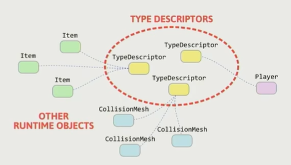

# Lecture1 Modern Game Engine - From Getting Started to Practice

> Game Engine Architecture

## 1. History of Game Engine

### Father of Game Engine

#### John Carmack

- He conceived and executed a new way of organizing the components of computer games by separating execution of core functionality by the game engine from the creative assets that filled the play space and content of a specific game title.

#### Wolfenstein 3D 1992

- It has been termed the "father of 3D shooters"

#### Doom

- Along with its predecessor Wolfenstein 3D,it helped define the FPS genre and inspired numerous similar games, often called Doom clones. It was the first online distribution game, and it pioneered technologies including 3D graphics, networked multiplayer gaming, and support for custom modifications via packaged WAD files.

#### Engine License

- 1994, ID Software license Doom engine to Raven, which built a successful game ShadowCaster based on it.

### Early Age of Modern Game Engine

#### Quake

Unlike what Doom engine did previously, the Quake engine offered full real-time 3D rendering and had early support for early 3D acceleration through OpenGL.

#### Development of the Hardware

#### Zoo of Game Engines

#### Middleware

## 2. What is Game Engine

> Wikipedia
>
> A game engine is a software framework primarily designed for the development of video games, and generally includes relevant libraries and support programs. The "engine" terminology is similar to the term "software engine" used in the software industry. 
>
> Game engine can also refer to the development software utilizing this framework, typically offering a suite of tools and features for developing games.
>
> Developers can use game engines to construct games for video game consoles and other types of computers.  The core functionality typically provided by a game engine may include a rendering engine ("renderer") for 2D or 3D graphics,a physics engine or collision detection (and collision response), sound,scripting,animation, artificial intelligence, networking,streaming,memory management,threading,localization support,scene graph, and video support for cinematics.  Game engine implementers often economize on the process of game development by reusing/adapting, in large part,the same game engine to produce different games or to aid in porting games to multiple platforms.

Our definition

- Technology Foundation of Matrix
- Productivity Tools for Creation
- Art of Complexity

### Complexity of Simulation

### Limited Power in Realtime

- Have to submit within 1/30s (30 FPS)
- even more harsh requirements (within 15ms-60FPS)

### Toolchain for Creators

### Developer Platform

- For Programmer
  - Expandable API interface allow programmers to define various of gameplay without changing the core
- For Studio
  - Collaborate hundreds of developers with different disciplinary work smoothly together

Yes, We are... The Creator and Operator of this Ugly Monster. But, Future will be Tougher...

## 3. How to Learn Game Engine

## 4. Course Content

### Basic Elements

- Engine Structure and Layer

- Data Organization and Management

### Rendering

- Model, Material, Shader, Texture
- Light and Shadow
- Render Pipeline
- Sky, Terrain, etc

### Animation

- Basic Concepts of Animation
- Animation Structure and Pipeline

### Physics

- Basic Concepts of Physics System
- Gameplay Applications
- Performance Optimization

### Gameplay

- Event System
- Scripts System
- Graph Driven

### Misc Systems

- Effects
- Navigation
- Camera

### Toolset

- C++ Reflection
  - It allows to expose variables and functions to be used in the editor. That is, the game creation tool will use a form of reflection (or similar) on the code provided by the developers, which then allows it to expose parts of it in editors for designers.

- Data Schema
  - A data schema is the formal description of the structures a system is working with.

### Online Game

- Lockstep Synchronization
- State Synchronization
- Consistency

### Advanced Technology

#### Motion Matching

- Motion Matching is a simple yet powerful way of animating characters in games. Compared to other methods, it doesn't require very much manual work once you have a basic set-up: there is no need to structure clips in graphs, to carefully cut or synchronize them, or to explicitly create new transitions between status.

#### Procedural Content Generation

PCG is a method of creating data algorithmically as opposed to manually, typically through a combination of human-generated assets and algorithms coupled with computer-generated randomness and processing power.

#### Data-Oriented Programming (DOP)

DOP is an exciting new paradigm that eliminates the usual complexity caused by combining data and code into objects and classes. In DOP, you maintain application data in persistent generic data structures separated from the program's code. You use general-purpose functions to manipulate the data without mutating it. This approach rids your applications of state-related bugs and makes your code much easier to understand and maintain.

#### Job System

A job system manages multithreaded code by creating jobs instead of threads.

#### Lumen

Unreal Engine 5's new fully dynamic global illumination and reflections system that is designed for nextgeneration consoles. It renders diffuse interreflection with infinite bounces and indirect specular reflections in large, detailed environments at scales ranging from millimeters to kilometers.

#### Nanite

Unreal Engine 5's new virtualized geometry system which uses a new internal mesh format and rendering technology to render pixel scale detail and high object counts.

## 5. Course Logistics

- Course Website: https://games104.boomingtech.com/tc/
- Q&A: https://games-cn.org/forums/forum/games104-forum/
- Reference Book: Game Engine Architecture 3rd or later edition

### Mini Engine

- Mini runtime framework
- Mini editor
- Building basic knowledge system of game engine

### Course Project

- Starting midway of this course
- References will be provided, but you decide the topic
- Best work will be posted online or showing off

