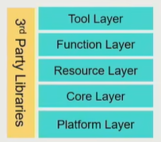
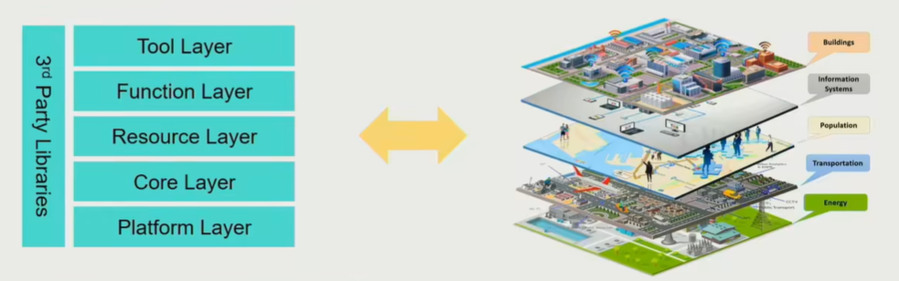
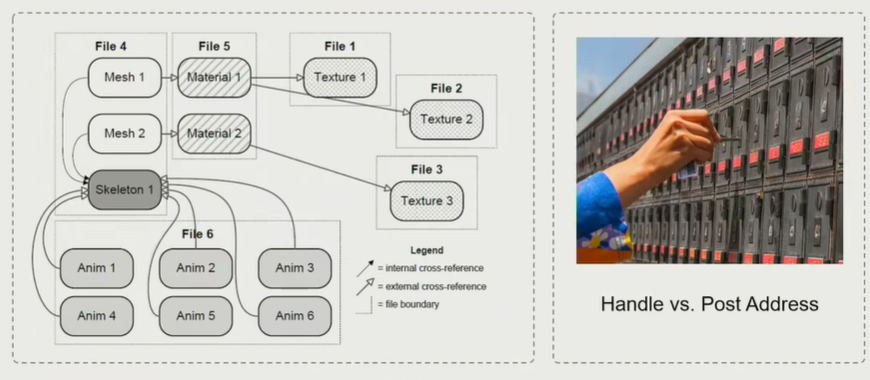
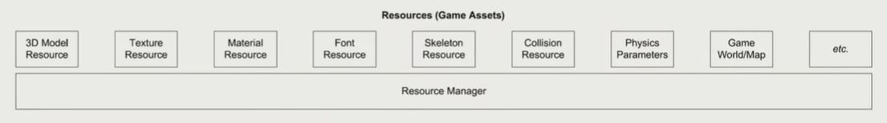
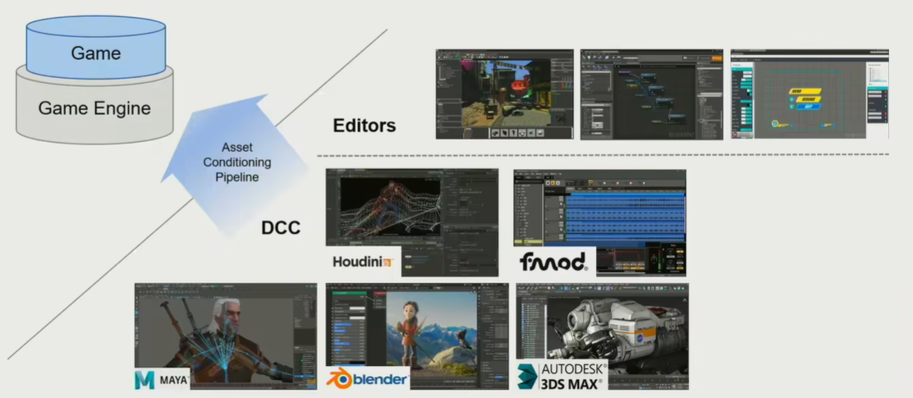
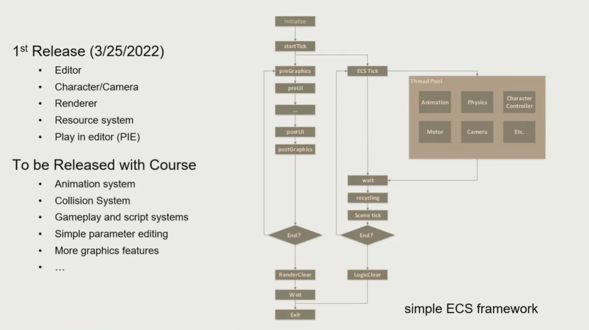

# Lecture2 Layered Architecture of Game Engine

## 1. Sea of Codes - Where to begin

### A Glance of Game Engine Layers

#### Tool Layer - Chain of Editors

#### Function Layer - Make it visible, movable and playable

#### Resource Layer - Data and Files

#### Core Layer - Swiss Knife of Game Engine

#### Platform Layer - Launch on Different Platforms

#### Middleware and Third party Libraries

### Why Layered Architecture

- Decoupling and Reducing Complexity
  - Lower layers are independent from upper layers
  - Upper layers don't know how lower layers are implemented
  - Upper layer can call lower layer, but lower layer can not call upper layer
- Response for Evolving Demands
  - Upper layers **evolve fast**, but lowers are **stable**

## 2. Practice is the Best Way to Learn

### Task - Simple Animated Character Challenge

- Create, animate and render a character
- Playable on selected hardware platform

### Resource - How to Access my Data

Offline Resource Importing

- Unify file access by defining a **meta asset** file format (eg, `.ast`)
  - easier for GPU to use
  - assets are faster to access by importing preprocess
- Build a **composite asset** file to refer to all resources
- **GUID** is an extra protection of reference
  - asset identity

#### Runtime Asset Manager

- A virtual file system to load/unload assets by path reference
- Manage asset lifespan and reference by handle system

#### Manage Life Cycle

- Different resources have different life cycles
- Limited memory requires release of loaded resources when possible 
- Garbage collection and deferred loading is critical features

### Function - How to Make the World Alive

#### Dive into Ticks

- tick: experience all the functions with 1/30s to make the game looks natural

- `tickLogic` and `tickRender` are two different aspects

#### Tick the Animation and Renderer

- In each tick (over-simplified version)
  - Fetch animation frame of character
  - Drive the skeleton and skin of character
  - Renderer process all rendering jobs in an iteration of render tick for each frame

#### Function is Heavy-duty Hotchpotch

- Function Layer provides major function modules for the game engine 
  - Object system (HUGE)
- Game Loop updates the systems periodically
  - Game Loop is the key of reading codes of game engines
- Blur the boundary between engine and game 
  - Camera, character and behavior
  - Design extendable engine API for programmer

#### Multi-Threading

- **Multi-core processors** become the mainstream
  - Many systems in game engine are built for parallelism

### Core - Foundation of Game Engine

- Core layers provide utilities needed in various function modules 
- Super high performance design and implementation 
- High standard of coding

#### Math Library

- Linear algebra
  - Rotation, translation, scaling
  - Matrix splines, quaternion

#### Math Efficiency

#### Data Structure and Containers

- Vectors, maps, trees, etc.
- Customized outperforms STL
- Avoid fragment memory

#### Memory Management

- Major bottlenecks of game engine performance
  - Memory Pool / Allocator
  - Reduce cache miss
  - Memory alignment
- Polymorphic Memory Resource (PMR)

For game engine, it will request a large amount of memory at once, and then arrange on that basis

How to make memory management fast

- Put data together
- Access Data in Order
- Allocate and De-allocate as a block

### Platform - Target on Different Platform

#### File system

Compatibility of different platforms, provides platform-independent services and information for upper layers

- Path: Slash/Backslash, Environment variables
- Directory Traversal

#### Graphics API

**Render Hardware Interface (RHI)**

- Transparent different GPU architecture and SDK
- Automatic optimization of target platforms

#### Hardware Architecture

### Tool - Allow Anyone to Create Game

- Unleash the creativity
  - Build upon game engine
  - Create, edit and exchange gameplay assets
- Flexible of coding languages
  - C++, C#, HTML

### Digital Content Creation (DCC)

## 3. Mini Engine - Pilot

> https://github.com/BoomingTech/Piccolo

### Introduction

- Build by C/C++
  - Runtime: ~13,000 lines
  - Editor: ~2,000 lines
- Follow Engine Layers
  - Source code still improving
- Support Platform
  - Windows
  - Linux
  - MacOS

### Function

- Basic Editing
  - Add/Delete Objects
  - Move/Scale/Rotate objects
- Simple Functions
  - Character control
  - Camera

