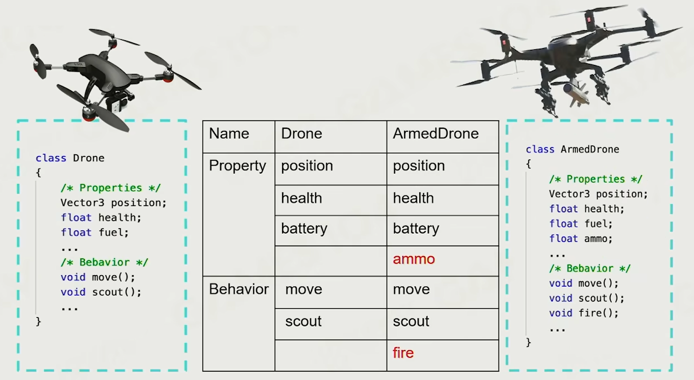
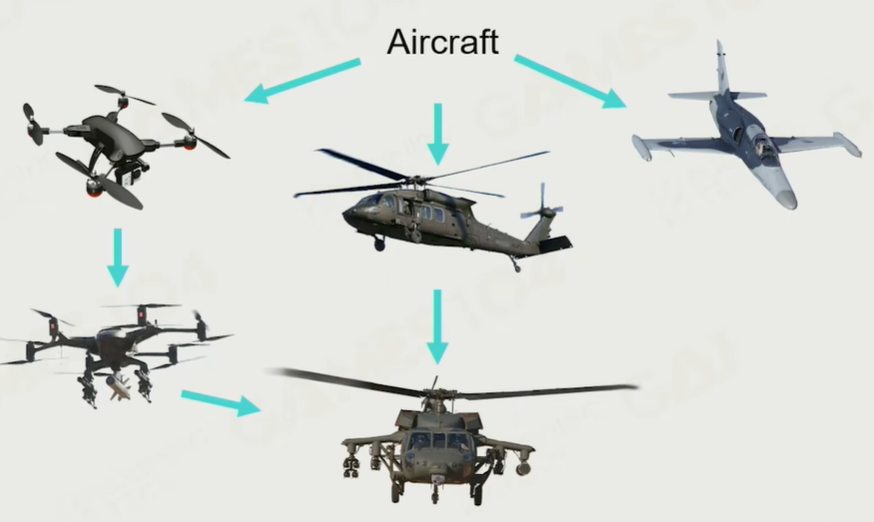
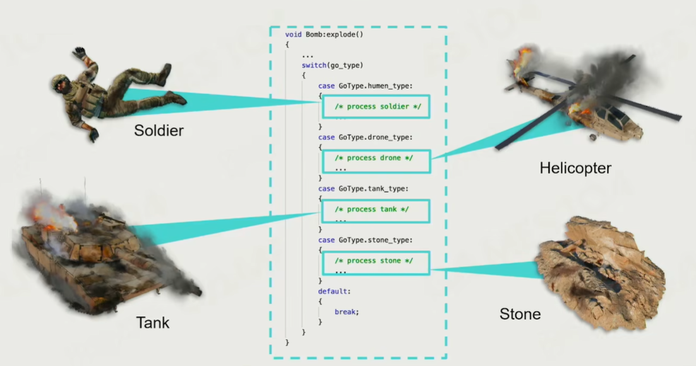

# Lecture3 How to Build a Game World

## 1. Game World Objects

### Dynamic Game Objects

- Interactable

### Static Game Objects

- Non-Interactable

### Environments

### Other Game Objects

### Everything is a Game Object

- Game Object (GO)

## 2. How to Describe a Game Object

> Want to build a drone

### Properties and Behavior

- Property: Shape, Position, Capacity of battery, etc.
- Behavior: Movement

### Inheritance / OOP

Drone vs. Armed Drone

#### Code Example

#### Cons

No perfect classification in the game world

### Component Based

- Component Composition in the real world

#### Code Example

#### Components in Commercial Engines

## 3. How to Make the World Alive

### Object-based Tick

- Simple and Intuitive
- Easy to debug

### Component-based Tick

- Parallelized processing
- Reduced cache miss
- More efficient

## 4. How to Interact between Game Objects

### Hardcode

### Events

- Message sending and handling
- Decoupling event sending and handling
- Encapsule the message into an event
- Decoupling 

#### Event Mechanism in Commercial Engines

## 5. How to Manage Game Objects

> The bomb effects all the game objects in the scene

### Scene Management

- Game objects are managed in a scene
- Game object query
  - By **unique game object ID**
  - By object position

#### No division

- Notify all the game objects in the scene
- $O(n^2)$ challenge

#### Divided by grid

- Find the neighbor grid
- Cons: game objects in the scene are not equally distributed

#### Hierarchical Segmentation

- Segmented space by object clusters

  

### Spatial Data Structures

- Is the core in game engine and scene management
- Implement in different structure due to different game

## 6. Other

### GO Bindings

- When player is bound with a tank, how to tick
- Tick father game objects the first, and then tick the child game objects

### Component Dependencies

- The sequence to tick the component is important (May in parallel execution)
- Different components can send message to each other simultaneously
- We want the game to be deterministic

### Post Office

- Post office takes charge of all the messages
- Pre-tick and Post-tick to solve the sequential problem

## 7. Summary

- Everything is a game object in the game world
- Game object could be described in the component-based way
- States of game objects are updated in tick loops
- Game objects interact with each other via event mechanism
- Game objects are managed in a scene with efficient strategies
