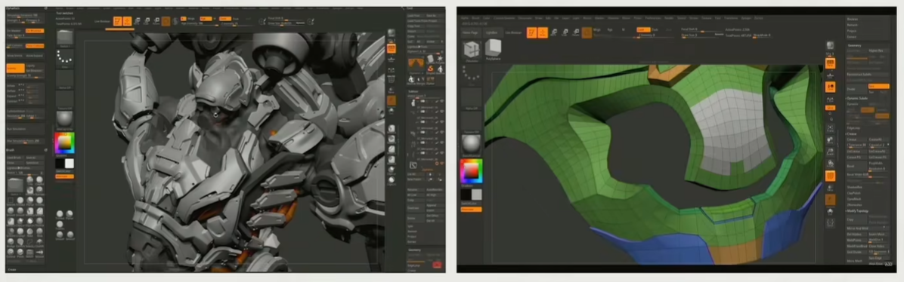

# Lecture4 Rendering System in Games

## 1. Introduction to Rendering

- Is there any game without rendering? Text Game

### Rendering on Graphics Theory

- Foundation of game engine rendering
- Objects with one type of effect
- Focus on representation and math correctness
- No strict performance requiement
  - Realtime 30 fps
  - Interactive 10 fps
  - Offline Rendering
  - Out-of-Core Rendering (too many data)

### Challenges on Game Rendering

- Tens of thousands of objects with dozens type of effects

- Deal with architecture of modern
- Computer with a complex combination of CPU and GPU

- Commit a bullet-proof framerate
  - 30 fps, 60 fps, even 120 fps(VR)
  - 1080, 4K and 8K resolution

- Limit access to CPU bandwidth and memory footprint
- Game logic, network, animation, physics and AI systems are major consumers of CPU and main memory

### Rendering on Game Engine

A heavily optimized practical software framework to fulfill the critical rendering requirements of games on modern hardware (PC, console and mobiles)

### Outline of Rendering

### What is not Included

- Cartoon Rendering
- 2D Rendering Engine
- Subsurface
- Hair / Fur

## 2. Building Blocks of Rendering

### Rendering Pipeline and Data

> Check GAMES101 for more details

### Computation

#### Projection and Rasterization

#### Shading

- A shader sample code
  - Constant / Parameters
  - ALU algorithms
  - Texture Sampling
  - Branches

#### Texture Sampling

1. Use two nearest mipmap levels
   - sample 8 pixel point, do 7 interpolation
2. Perform bilinear interpolation in both mip-maps
3. Linearly interpolate between the result

## 3. GPU

The dedicated hardware to solve massive jobs

### SIMD and SIMT

#### SIMD Single Instruction Multiple Data

- Describes computers with multiple processing elements that perform the same operation on multiple data points simultaneously

#### SIMT Single Instruction Multiple Threads

- An execution model used in parallel computing where single instruction, multiple data is combined with multithreading

### GPU Architecture

- GPC Graphics Processing Cluster
  - A dedicated hardware block for computing, rasterization, shading and texturing
- **SM Streaming Multiprocessor**
  - Part of the GPU that runs CUDA kernels
- **Texture Units**
  - A texture processing unit, that can fetch and filter a texture
- **CUDA Core**
  - Parallel processor that allow data to be worked on simultaneously by different processors
- **Wrap**
  - A collection of threads

### Data Flow from CPU to GPU

Game Engine try to transfer data from CPU to GPU, instead of reading data from GPU

- **CPU and Main Memory**
  - Data Load / Unload
  - Data Preparation
- **CPU to GPU**
  - High Latency
  - Limited Bandwidth
- **GPU and Video Memory**
  - High Performance Parallel Rendering

### Cache Efficiency

- Take full advantage of hardware parallel computing
- Try to avoid the von Neumann bottleneck

### GPU Bounds and Pefroamance

- Application performance is limited by
  - Memory Bounds
  - ALU Bounds
  - TMU (Texture Mapping Unit) Bound
  - BW (Bandwidth) Bound

### Modern Hardware Pipeline

### Other State-of-Art Architectures

#### Console

#### Mobile Phone

## 4. Renderable

### Mesh Render Component

- Everything is a game object in the game world
- Game object could be described in the **component-based** way
- Some component (mesh, skin) is renderable (which will be rendered on the screen)

### Mesh

#### Vertex and Index Buffer

- Vertex Data
  - Vertex declaration
    - position
    - color
    - normal
  - Vertex buffer
- Index Data
  - Index declaration
    - index of a specific vertex
  - Index buffer

We need per-vertex normal

### Material

- Determine the appearance of objects, and how objects interact with light

#### Famous Material Models

#### Various Textures in Materials

### Shaders

- A pair of code telling GPU how to execute in each vertex

### Render Objects in Engine

#### Coordinate System and Transformation

- Model assets are made based on local coordinate systems, and eventually we need to render them into screen space

#### Object with Many Materials

- Submit vertex & index buffer, materials parameters, textures, shader

### How to Display Different Texture on a Single Model

If every part use the same materials, it's not appear to be realistic

#### Submesh

- split the large mesh into different submesh, each submesh uses different texture and shader

#### Resource Pool

- use handle to reuse resources

#### Sort by Material

- Group different game object with the same material into one specific large mesh and pass it to GPU

#### GPU Batch Rendering

- Group rendering all instances with identical submeshes and materials together
  - Tree, grass, etc

## 5. Visibility Culling

For each view, there are a lot of objects which aren't needed to be rendered

### Culling One Object

#### Using the simplest Bound to Create Culling

- Inexpensive intersection texts
- Tight fitting
- Inexpensive to compute
- Easy to rotate and transform
- Use little memory

### Hierarchical View Frustum Culling

#### QTC and BVH

- Construction and Insertion of BVH in Game Engine
  - Adapted for dynamic moving object, easy for calculation

#### PVS

- Divide each room into node, each corridor into edge

- PVS Potential Visibility Set
- The idea of using PVS can be treated in different zoom in games

### GPU Culling

## 6. Texture Compression

- Traditional image compression like JPG and PNG
  - Good compression rates
  - Image quality
  - Designed to compress and decompress
  - an entire image
- In game texture compression
  - Decoding speed
  - Random access
  - Compression rate and visual quality
  - Encoding speed

### Block Compression

- A 4x4 color block
- find the brightest and the darkest color
- perform interpolation between these two colors, store the distance relationship

#### Common block-based compression format

- PC: BC7, DXTC
- Mobile: ASTC, ETC/PVRTC

## 7. Authoring Tools of Modeling

### Modeling

#### Polymodeling

#### Sculpting

#### Scanning

#### Procedural Modeling

### Comparison of Authoring Methods

## 8. Cluster-Based Mesh Pipeline

### Sculpting Tools Create Infinite Details

- Artists create models with infinite details
- From linear fps to open world fps complex scene submit 10 more times triangles to GPU per-frame

### New Clusted-Based Pipeline

- Modern GPU can generate different details based on a block of mesh cluster

### Nanite

- Hierarchical LOD clusters with seamless boundary
- Don't need hardware support, but using a hierarchical cluster culling on the precomputed BVH tree by persistent threads (CS) on GPU instead of task shader

## 9. Take Away

- The design of game engine is **deeply related to the hardware** architecture design
- A **submesh** design is used to support a model with multiple materials
- Use **culling algorithms** to **draw as few objects as possible**
- As GPU become more powerful, more and more work are **moved into GPU**, which called **GPU Driven**